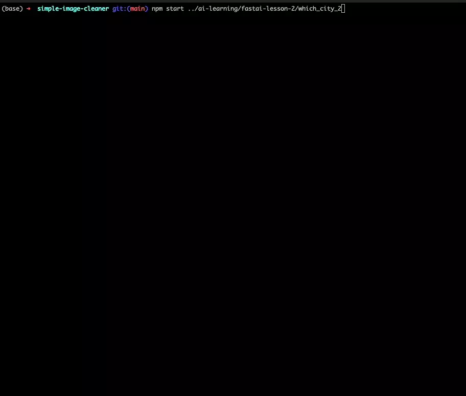

# Simple Image Cleaner

This is a REALLY simple program to clean a set of images. It was built for cleaning training data for deep learning (AI) image classifiers.

This project has zero dependencies and only 2 files. `index.js` is a NodeJS server and `index.html` is the web interface.

To function it requires a directory structure as follows:

- images/
    - label/
        - somefile.jpg
        - somefile.png
        - somefile.gif
    - other-label/
        - afile.jpg
        - bfile.png
        - cfile.gif

This is a common folder structure for training data where each folder represents a label containing images of that type.

## Usage

- Run: `npm start /path/to/images/folder`
- Open your web browser to http://localhost:8080
- Use left/right arrow keys to navigate through images
- Press the `D` key to delete the current image

> Note: when you press `D` the file will be immediately deleted. This cannot be undone.

## Example

